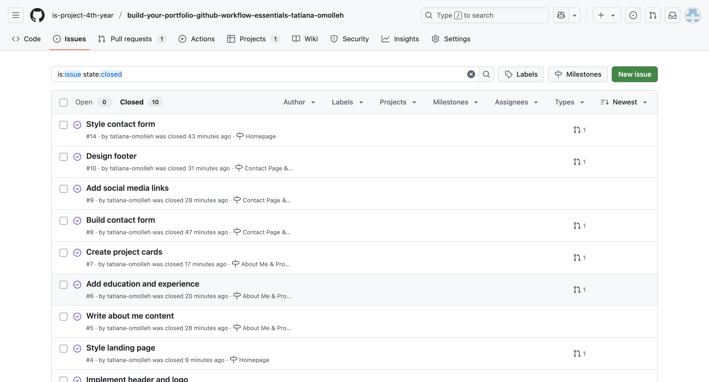
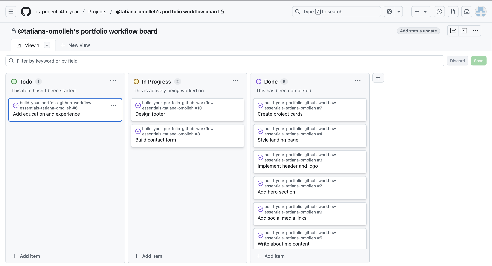
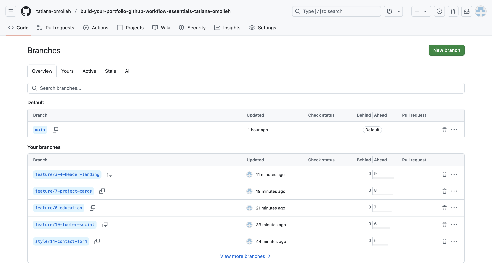
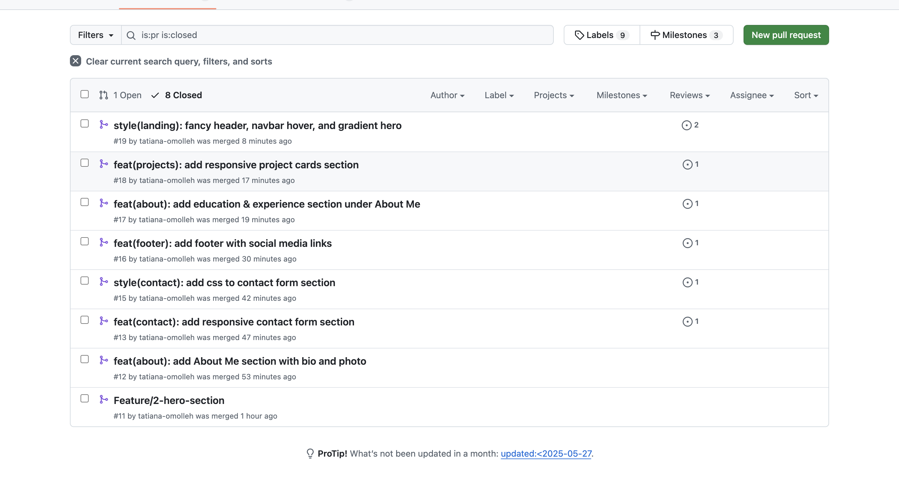
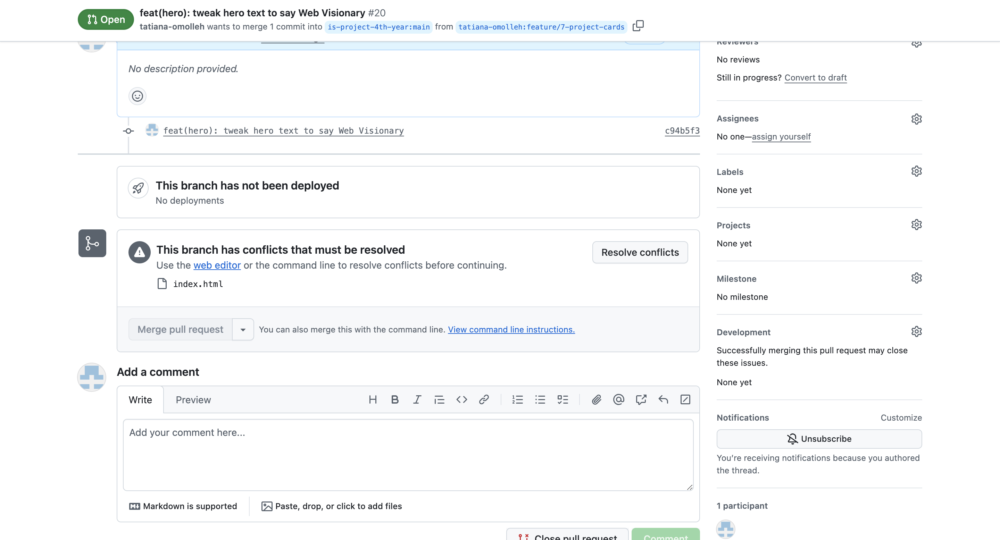

# Personal Portfolio Documentation

## 1. Student Details

- **Tatiana Omolleh**:
- **tatiana-omolleh**:
- **tatianaomolleh@12gmail.com**:

## 2. Deployed Portfolio Link

- **GitHub Pages URL**:  
  _https://is-project-4th-year.github.io/build-your-portfolio-github-workflow-essentials-tatiana-omolleh/_

## 3. Learnings from the Git Crash Program

- **Branching**: Helped me separate features and prevent conflicts.
- **Pull Requests**: Allowed structured code reviews and safe merges.
- **Issue Linking**: Ensured each feature closes specific requirements.
- **Conflict Resolution**: Practiced resolving real conflicts with GitHub’s UI.

## 4. Screenshots of Key GitHub Features

### A. Milestones and Issues

### B. Project Board

### C. Branching

### D. Pull Requests

### E. Merge Conflict Resolution

